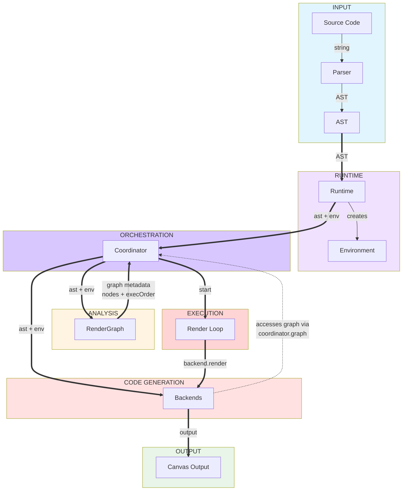
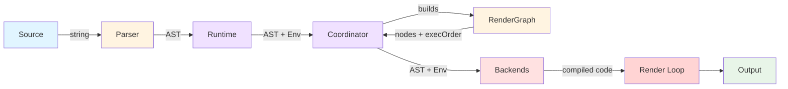
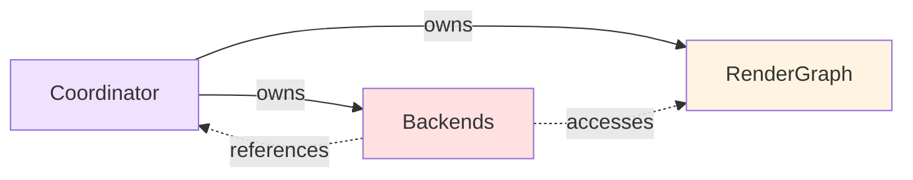

# WEFT Runtime Architecture

## System Architecture

## Key Data Flows

## Component Responsibilities

| Component | Responsibility | Key Methods |
|-----------|---------------|-------------|
| **Parser** | Convert source → AST | `parse(source)` |
| **Runtime** | Entry point & lifecycle | `compile()`, `start()`, `stop()` |
| **Environment** | Global state | canvas, frame, mouse, vars |
| **Coordinator** | Orchestrate compilation & rendering | `compile()`, `mainLoop()`, `getValue()` |
| **RenderGraph** | Dependency analysis | `build()`, `collectInstances()`, `topoSort()`, `tagContexts()` |
| **CPUEvaluator** | JIT fallback | `getValue()`, `compileToJS()` |
| **WebGL Backend** | GPU rendering | `compile()`, `generateFragmentShader()`, `render()` |
| **Audio Backend** | Audio playback | `compile()`, `render()` |

## Key Relationships

**Ownership**: Solid arrows (→)
**References/Access**: Dashed arrows (-.->)
